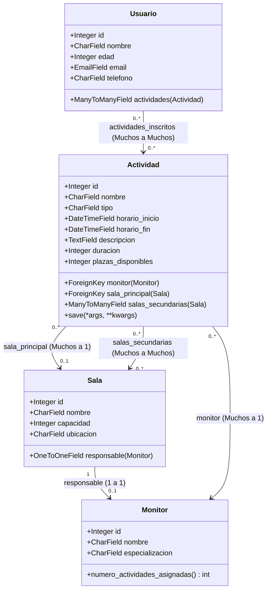

# 🎭 Sistema de Gestión de Actividades - Centro Cultural Municipal

[](https://djangoproject.com)
[](https://python.org)
[](https://sqlite.org)
[](https://fonts.google.com/specimen/Inter)

Una plataforma web moderna y robusta diseñada para el **Centro Cultural Municipal**. Esta aplicación digitaliza por completo la administración de talleres, salas, inscripciones y personal, sustituyendo los sistemas obsoletos basados en papel por un flujo de trabajo optimizado que previene conflictos de horarios, sobreventa de aforos y pérdida de datos.

---

## 🗺️ Tabla de Contenidos
1. [Contexto y Propósito del Proyecto](#-contexto-y-propósito-del-proyecto)
2. [Stack Tecnológico y Arquitectura](#-stack-tecnológico-y-arquitectura)
3. [Modelos del Dominio (Base de Datos)](#-modelos-del-dominio-base-de-datos)
4. [Lógica de Negocio y Validaciones Avanzadas](#-lógica-de-negocio-y-validaciones-avanzadas)
5. [Mapa de Endpoints y Rutas (CRUD)](#-mapa-de-endpoints-y-rutas-crud)
6. [Diseño de Interfaz Premium (CSS Dark Mode)](#-diseño-de-interfaz-premium-css-dark-mode)
7. [Guía de Instalación y Ejecución Local](#-guía-de-instalación-y-ejecución-local)

---

## 💡 Contexto y Propósito del Proyecto

El **Centro Cultural Municipal** ofrece una variada oferta de talleres artísticos, formativos y de ocio. Anteriormente, la gestión manual provocaba solapamientos de salas, monitores asignados a múltiples actividades al mismo tiempo y descontrol en la capacidad máxima de asistentes. 

Este sistema proporciona una **solución integral**:
*   **Gestión Centralizada:** Registro y control de actividades, usuarios inscritos, salas físicas y monitores.
*   **Validación de Conflictos Inteligente:** Algoritmos en tiempo real para evitar que una sala (ya sea principal o secundaria) sea asignada a dos actividades que se cruzan en el tiempo.
*   **Gestión de Aforo Garantizada:** Mecanismos atómicos que controlan la disponibilidad de plazas de manera automática al inscribir o cancelar la participación de los usuarios.

---

## 🛠️ Stack Tecnológico y Arquitectura

El sistema ha sido estructurado bajo una arquitectura de alta cohesión y bajo acoplamiento:

*   **Backend:** **Python 3.x** y **Django 6.0**, aprovechando el potente ORM de Django, sus motores de validación de formularios y su robusto sistema de mensajes flash.
*   **Base de Datos:** **SQLite3** para un almacenamiento ágil y autocontenido en desarrollo.
*   **Frontend:** Plantillas nativas de Django (`Django Templates`) potenciadas con un motor de renderizado HTML5 semántico y una hoja de estilos CSS3 global personalizada con variables de diseño CSS, tipografía web moderna (`Inter`) y adaptabilidad móvil fluida.
*   **Patrón Arquitectónico:** **MVT (Model-View-Template)**, asegurando que la lógica de negocio (Modelos), el control de flujo (Vistas) y la representación gráfica (Plantillas) se mantengan completamente limpios y separados.

---

## 🗃️ Modelos del Dominio (Base de Datos)

El corazón de la aplicación está compuesto por 4 modelos principales vinculados con relaciones bien definidas:



### Detalle de Campos y Reglas por Modelo

| Entidad / Modelo | Campo | Tipo | Restricciones / Comportamiento |
| :--- | :--- | :--- | :--- |
| **`Monitor`** | `nombre` | `CharField(100)` | Nombre completo del docente/instructor. |
| | `especializacion` | `CharField(100)` | Área de especialidad (ej. *Teatro, Cerámica, Pintura*). |
| | *Método* | `numero_actividades_asignadas()` | Cuenta dinámicamente cuántas actividades tiene a su cargo. |
| **`Sala`** | `nombre` | `CharField(100)` | Identificador del espacio (ej. *Aula 102, Salón de Actos*). |
| | `capacidad` | `IntegerField` | Aforo máximo de personas permitido. |
| | `ubicacion` | `CharField(100)` | Indicación de planta o sector (ej. *Planta 1, Ala Oeste*). |
| | `responsable` | `OneToOneField(Monitor)` | Relación 1-a-1. Monitor a cargo del equipo técnico del espacio. Puede ser nulo/vacío. |
| **`Actividad`** | `nombre` | `CharField(100)` | Título descriptivo del taller. |
| | `tipo` | `CharField(50)` | Categoría de la actividad. |
| | `horario_inicio`| `DateTimeField` | Fecha y hora exacta de comienzo. |
| | `horario_fin` | `DateTimeField` | Calculado y almacenado de forma automática. No editable manualmente. |
| | `descripcion` | `TextField` | Detalle o temario de la actividad. |
| | `duracion` | `IntegerField` | Duración expresada en minutos. |
| | `plazas_disponibles`| `IntegerField` | Cupos libres para nuevas inscripciones. |
| | `monitor` | `ForeignKey(Monitor)` | Instructor a cargo. Relación Muchos a 1 con relación inversa `actividades`. |
| | `sala_principal` | `ForeignKey(Sala)` | Espacio asignado principal. Relación Muchos a 1 (`actividades_principal`). |
| | `salas_secundarias`| `ManyToManyField(Sala)` | Espacios auxiliares reservados de apoyo. Relación Muchos a Muchos. |
| **`Usuario`** | `nombre` | `CharField(100)` | Nombre y apellidos del alumno inscrito. |
| | `edad` | `IntegerField` | Edad del usuario. |
| | `email` | `EmailField` | Correo electrónico de contacto. |
| | `telefono` | `CharField(15)` | Teléfono de contacto. |
| | `actividades` | `ManyToManyField(Actividad)`| Talleres en los que está inscrito. Relación inversa `usuarios_inscritos`. |

---

## ⚡ Lógica de Negocio y Validaciones Avanzadas

El sistema destaca por la implementación de reglas de negocio robustas directamente a nivel de modelo y formulario:

### 1. Cálculo Automatizado del Horario de Cierre
En el modelo `Actividad`, el campo `horario_fin` no es editable en la interfaz. El sistema calcula de forma exacta la hora de finalización en el método sobreescrito `save()` utilizando la duración de la actividad en minutos:
```python
def save(self, *args, **kwargs):
    if self.horario_inicio and self.duracion:
        from datetime import timedelta
        self.horario_fin = self.horario_inicio + timedelta(minutes=self.duracion)
    super().save(*args, **kwargs)
```

### 2. Algoritmo de Prevención de Solapamiento de Salas
Para evitar conflictos donde dos actividades ocupen la misma sala en el mismo intervalo de tiempo, `ActividadForm` (dentro de `forms.py`) ejecuta una validación avanzada en su método `clean()`:
1. Define un rango temporal con la nueva actividad (entre `horario_inicio` y `horario_fin`).
2. Genera una consulta de intersección horaria lógica:
   $$\text{Solapamiento} = (\text{inicio\_existente} < \text{fin\_nuevo}) \land (\text{fin\_existente} > \text{inicio\_nuevo})$$
3. Excluye la actividad actual si se trata de una edición (`self.instance.pk`).
4. **Verificación de Sala Principal:** Valida si la `sala_principal` elegida ya está ocupada como sala principal o secundaria en otra actividad que se solape.
5. **Verificación de Salas Secundarias:** Itera sobre cada una de las `salas_secundarias` solicitadas, corroborando que no estén reservadas como principal o secundaria en actividades concurrentes.

Si se detecta cualquier cruce de espacios, el formulario añade errores de campo específicos (`self.add_error`) impidiendo el guardado y alertando visualmente al usuario.

### 3. Registro Controlado y Atómico de Inscripciones
En la vista de inscripción (`inscribir_usuario` en `views.py`), se aplican estrictas medidas de control de flujo antes de modificar los datos:
*   **Control de Duplicidad:** Se comprueba si el usuario seleccionado ya forma parte de la lista `usuarios_inscritos` de la actividad. Si es así, se le deniega el registro con un mensaje de error.
*   **Validación de Cupo:** Se consulta en tiempo real si el valor de `plazas_disponibles` es superior a 0.
*   **Transacción Atómica de Aforo:** Al cumplir todos los requisitos, el usuario es añadido a la relación ManyToMany y, simultáneamente, se ejecuta una consulta optimizada utilizando **expresiones F** de Django:
    ```python
    Actividad.objects.filter(pk=id).update(plazas_disponibles=F('plazas_disponibles') - 1)
    ```
    Esto garantiza la consistencia del contador de aforo directamente en la base de datos, previniendo condiciones de carrera si varios administradores inscriben alumnos al mismo tiempo.
*   **Cancelación Segura:** Al eliminar una inscripción, el usuario es removido y el aforo se restablece incrementando de forma segura la plaza:
    ```python
    Actividad.objects.filter(pk=actividad_id).update(plazas_disponibles=F('plazas_disponibles') + 1)
    ```

---

## 🔗 Mapa de Endpoints y Rutas (CRUD)

La aplicación ofrece un set de rutas completo que estructura el panel de administración del centro cultural:

| Módulo | Ruta URL (Pattern) | Vista Asociada | Método HTTP | Descripción |
| :--- | :--- | :--- | :--- | :--- |
| **Inicio** | `/` | `home` | `GET` | Dashboard general con KPIs de contadores y actividades recientes. |
| **Actividades** | `/actividades/` | `lista_actividades` | `GET` | Panel de actividades con filtros de búsqueda por tipo y monitor. |
| | `/actividades/nueva/` | `nueva_actividad` | `GET`, `POST` | Formulario de creación de una nueva actividad. |
| | `/actividades/<int:id>/` | `detalle_actividad` | `GET` | Ficha técnica completa de la actividad y sus salas secundarias. |
| | `/actividades/<int:id>/editar/` | `editar_actividad` | `GET`, `POST` | Modificación de datos y salas asociadas a una actividad. |
| | `/actividades/<int:id>/eliminar/` | `eliminar_actividad` | `GET`, `POST` | Confirmación y baja lógica/física de una actividad. |
| **Usuarios** | `/usuarios/` | `lista_usuarios` | `GET` | Listado general de usuarios registrados con filtro por actividad. |
| | `/usuarios/nuevo/` | `nuevo_usuario` | `GET`, `POST` | Formulario de alta para un nuevo alumno. |
| | `/usuarios/<int:id>/` | `detalle_usuario` | `GET` | Perfil del usuario e histórico de talleres a los que asiste. |
| | `/usuarios/<int:id>/editar/` | `editar_usuario` | `GET`, `POST` | Actualización de la información de contacto del usuario. |
| | `/usuarios/<int:id>/eliminar/` | `eliminar_usuario` | `GET`, `POST` | Eliminación de la cuenta del usuario. |
| **Monitores** | `/monitores/` | `lista_monitores` | `GET` | Catálogo de instructores y su cantidad de actividades activas. |
| | `/monitores/nuevo/` | `nuevo_monitor` | `GET`, `POST` | Alta de nuevos instructores en la plantilla. |
| | `/monitores/<int:id>/` | `detalle_monitor` | `GET` | Información técnica del monitor y lista de cursos a su cargo. |
| | `/monitores/<int:id>/editar/` | `editar_monitor` | `GET`, `POST` | Edición del perfil profesional del monitor. |
| | `/monitores/<int:id>/eliminar/` | `eliminar_monitor` | `GET`, `POST` | Remoción de un monitor de la base de datos. |
| **Salas** | `/salas/` | `lista_salas` | `GET` | Listado de espacios físicos, capacidades e indicación de responsable. |
| | `/salas/nueva/` | `nueva_sala` | `GET`, `POST` | Incorporación de una nueva sala o aula. |
| | `/salas/<int:id>/` | `detalle_sala` | `GET` | Ficha detallada del aforo e infraestructura de la sala. |
| | `/salas/<int:id>/editar/` | `editar_sala` | `GET`, `POST` | Edición de capacidad, ubicación o reasignación del monitor técnico. |
| | `/salas/<int:id>/eliminar/` | `eliminar_sala` | `GET`, `POST` | Eliminación del aula en el sistema. |
| **Inscripciones**| `/actividades/<int:id>/inscripciones/` | `inscripciones_actividad` | `GET` | Listado completo de alumnos admitidos en una actividad concreta. |
| | `/actividades/<int:id>/inscribir/` | `inscribir_usuario` | `GET`, `POST` | Inscripción manual de un usuario existente en una actividad. |
| | `/actividades/<int:act_id>/inscripciones/<int:usr_id>/eliminar/`| `cancelar_inscripcion`| `GET`, `POST` | Cancelación de inscripción con reincorporación automática de aforo. |

---

## 🎨 Diseño de Interfaz Premium (CSS Dark Mode)

El frontend está desarrollado bajo estándares de diseño moderno que garantizan una experiencia inmersiva e interactiva:

*   **Paleta de Colores Futurista:** Uso de colores armónicos con alto contraste. Base oscura minimalista (`#0f1117`), superficies elegantes (`#1a1d2e`), bordes sutiles (`#2d3352`) y acentos en morado eléctrico (`#6c63ff`) y rosa coral (`#ff6584`).
*   **Tipografía Profesional:** Integración de la fuente **Inter** de Google Fonts para una legibilidad óptima y moderna en pantallas de cualquier densidad de píxeles.
*   **Micro-animaciones Fluidas:** Transiciones suaves de 0.2s en elementos interactivos (hover en tarjetas, transformación física en botones, cambios de color de borde al enfocar campos).
*   **Sidebar de Navegación Dinámica:** Menú lateral de 240px permanente con detección visual activa del endpoint actual del usuario y compatibilidad con pantallas táctiles.
*   **Componentes de Información Rápica (KPIs):** Tarjetas con degradados visuales que muestran indicadores clave en el dashboard principal.
*   **Responsividad Completa:** Maquetación con consultas de medios avanzadas (`@media`) que colapsan fluidamente la estructura a pantallas móviles de forma natural.

---

## 🚀 Guía de Instalación y Ejecución Local

Sigue estos pasos para desplegar el entorno de desarrollo local en tu ordenador:

### 1. Requisitos Previos
Asegúrate de tener instalado en tu máquina:
*   [Python 3.10 o superior](https://www.python.org/downloads/)
*   Gestor de paquetes `pip` (suele venir preinstalado con Python)

### 2. Clonación y Acceso al Directorio
Descarga el proyecto y accede a la carpeta que contiene el archivo `manage.py`:
```bash
cd /Users/administrador/Downloads/Gestion_activadades-main/gestion_actividades
```

### 3. Configuración del Entorno Virtual (Recomendado)
Crea y activa un entorno virtual aislado para mantener limpias las dependencias:
```bash
# Crear entorno virtual
python3 -m venv venv

# Activar en macOS / Linux
source venv/bin/activate

# Activar en Windows (PowerShell)
.\venv\Scripts\Activate.ps1
```

### 4. Instalación de Dependencias
Instala Django en tu entorno virtual:
```bash
pip install --upgrade pip
pip install django
```

### 5. Configuración de Base de Datos y Migraciones
El sistema utiliza SQLite3. Crea el esquema de tablas en tu base de datos local:
```bash
python manage.py makemigrations
python manage.py migrate
```

### 6. Creación de Superusuario (Acceso al Panel de Administración)
Para poder administrar todo el sistema desde el panel nativo de Django (`/admin/`), crea un usuario administrador inicial:
```bash
python manage.py createsuperuser
```
*(Sigue las instrucciones en la consola para definir el nombre de usuario, correo y contraseña).*

### 7. Ejecución del Servidor de Desarrollo
Pones en marcha el servidor local de Django:
```bash
python manage.py runserver
```

Una vez levantado, abre tu navegador de preferencia y dirígete a:
*   💻 **Aplicación General:** [http://127.0.0.1:8000/](http://127.0.0.1:8000/)
*   🛡️ **Panel de Administración (Django Admin):** [http://127.0.0.1:8000/admin/](http://127.0.0.1:8000/admin/)

---
*Desarrollado para la modernización de los centros culturales locales.* 🎭
